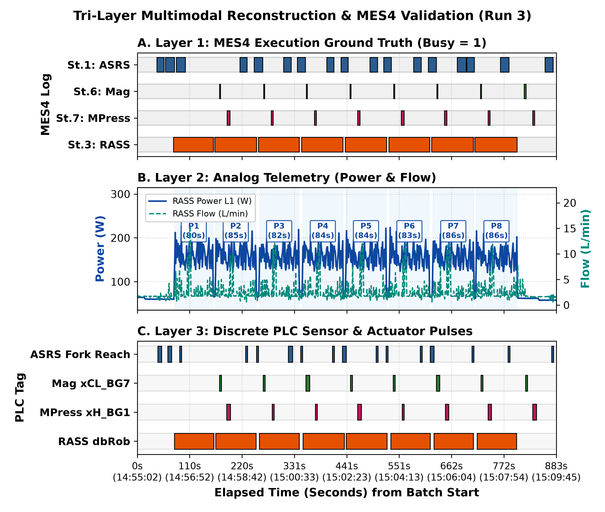
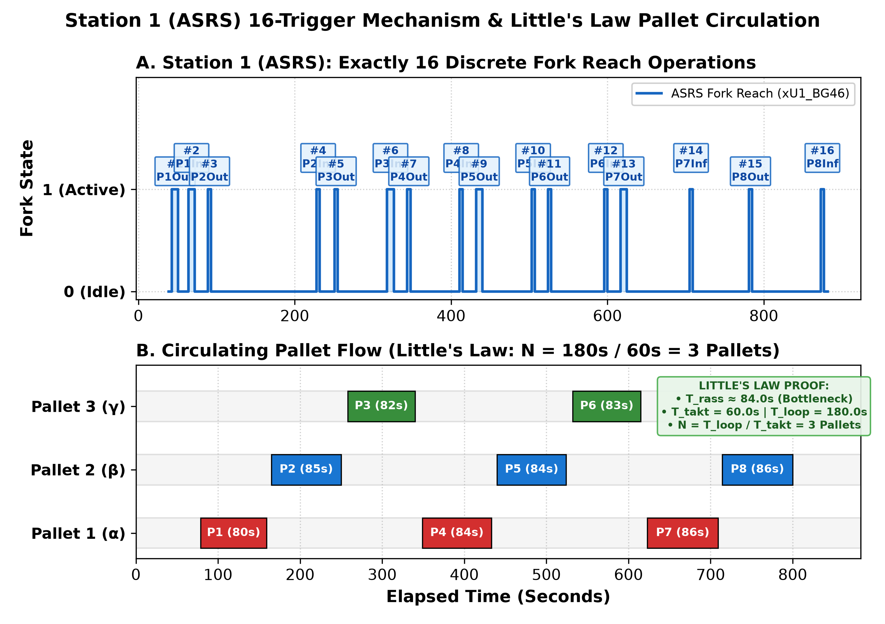
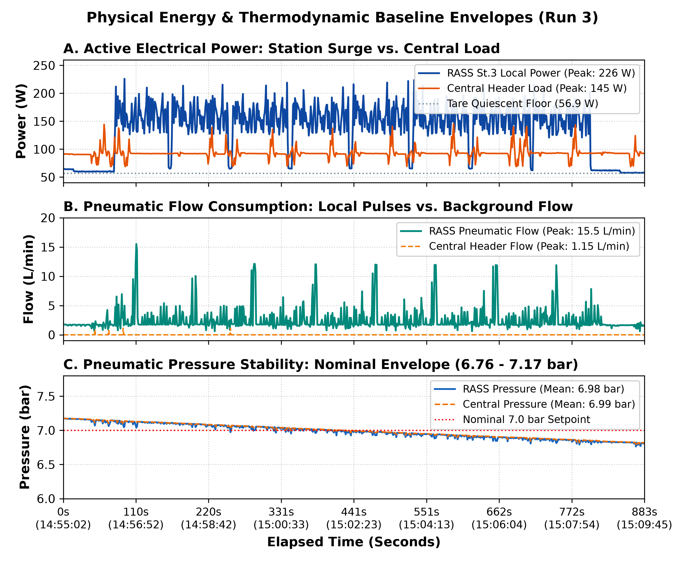

# Non-Invasive Multimodal Telemetry for Cyber-Physical Process Observability & Fault Diagnosis in Modular Smart Manufacturing

> ⚠️ **PROJECT STATUS: UNDER ACTIVE WORK / ONGOING RESEARCH**  
> **Authors:** Prof. Hisham ElMoaqet (Senior Member, IEEE) & Ramez Al-Masadeh  
> **Institution:** Department of Mechatronics Engineering & Industry 4.0 Laboratory, German Jordanian University (GJU), Amman, Jordan  
> **Target Venue:** *IEEE Transactions on Industrial Informatics*

---

## 1. Executive Summary & Research Motivation

Commercial Manufacturing Execution Systems (MES) track job orders and station dwells, but they are fundamentally **blind to the physical health of production equipment**. They cannot detect motor current surges, pneumatic line pressure drops, or progressive mechanical binding. At the same time, modifying programmable logic controller (PLC) ladder logic to log high-frequency diagnostics risks introducing scan jitter, causing network collisions, and voiding original equipment manufacturer (OEM) warranties.

This research introduces a **passive, non-invasive sensing and diagnostic framework** that captures 19 continuous thermodynamic channels and sniffs 546 discrete PLC tags across an industrial **Festo Cyber-Physical (CP) Factory** without modifying a single line of PLC code.

### The Three Connected Studies

```
┌───────────────────────────────────────────────────────────────────────────────┐
│                          RESEARCH PROGRAM ROADMAP                             │
├───────────────────────────────┬───────────────────────────────┬───────────────┤
│ STUDY 1: HEALTHY BASELINE     │ STUDY 2: FAULT LOCALIZATION   │ STUDY 3: ML   │
│ [COMPLETED & VALIDATED]       │ [IN PROGRESS / UNDER WORK]    │ [PLANNED]     │
├───────────────────────────────┼───────────────────────────────┼───────────────┤
│ • Tri-layer synchronization   │ • Symmetrical 10-fault matrix │ • Energy-only │
│ • 16-operation ASRS cycle     │ • 4-station pressure drops    │ • PLC-only    │
│ • Little's Law WIP (N = 3.0)  │ • Root-cause vs. starvation   │ • Early Fusion│
│ • Thermodynamic envelopes     │ • Cross-station transfer (0%) │ • Late Stack  │
└───────────────────────────────┴───────────────────────────────┴───────────────┘
```

---

## 2. Industrial Testbed Architecture (Festo CP Factory)

The testbed at the GJU Smart Factory Laboratory assembles miniaturized smart devices across four automated stations linked by a closed-loop dual-belt conveyor:

1. **Station 1 (ASRS High-Bay Warehouse)**: Siemens S7-1512SP (`172.21.1.1`). 3-axis Cartesian gantry crane that retrieves empty pallet carriers from rack shelves (Source) and stores finished assemblies (Sink).
2. **Station 6 (Magazine Feeder)**: Siemens S7-1512SP (`172.21.6.1`). Pneumatic cylinder pusher (`CL_MB1/MB2`) dispensing front housing covers.
3. **Station 7 (Muscle Press)**: Siemens S7-1512SP (`172.21.7.1`). Press station driven by a Festo Fluidic Muscle (`DMSP` pneumatic actuator) generating up to 10 bar pressing force.
4. **Station 3 (RASS Assembly Bottleneck)**: Siemens S7-1512SP (`172.21.3.1`). 6-DOF Mitsubishi articulated robot assembling PCBs and micro-fuses.

### Non-Invasive Data Pipeline
* **Thermodynamic Streams (1.0 Hz)**: Continuous electrical active power ($P_{\text{L1}}, P_{\text{L2}}, P_{\text{L3}}$), air flow ($Q$), and line pressure ($p$) logged via two Festo Energy Gateways (Central line `172.21.0.60` and Station 3 `172.21.3.60`).
* **Discrete PLC Switches (~3.9 s loop)**: 546 boolean state tags (cylinder reed switches, optical flags, station busy bits) polled via native OPC UA without scan cycle interference.

---

## 3. Study 1: Core Physical Discoveries & Baseline Verification

### A. Tri-Layer Synchronization vs. Festo MES4
Across an 883-second continuous production batch producing 8 finished workpieces (`NORMAL_RUN3`), our non-invasive telemetry achieved **100% synchronization** against official Festo MES4 ground truth:



* **Physical Lead Time**: Power surges at the robot bottleneck lead software MES `Busy=1` timestamps by **$+1.62\text{ s}$**, revealing the physical motion onset before commercial software flags react.
* **Mechanical Dwell vs. Software Flags**: Real mechanical cylinder strokes at Station 6 ($4.8\text{ s}$) and Station 7 ($6.1\text{ s}$) are $1.5\text{–}2.6\text{ s}$ longer than the brief software handshakes logged by MES4.

### B. Warehouse Kinematics: The 16-Operation ASRS Cycle
Festo MES4 logs record 17 discrete blocks for Station 1. Because Station 1 acts as both Source and Sink, physical crane kinematics dictate exactly 16 moves ($2 \times 8\text{ parts} = 16$):
* **8 Dispatches ($D_1$ to $D_8$)**: High-bay crane retrieves empty carrier and deposits onto outfeed track.
* **8 Deposits ($S_1$ to $S_8$)**: Crane retrieves finished product from infeed turntable (`xG1_BG21`) and shelves it.
* The 17th block in MES4 is an internal supervisory handshake between batches; position sensors (`xU1_BG51/BG53`) confirm the crane remains stationary at the shelf without homing.



### C. Mathematical Proof of Circulating Work-in-Process (Little's Law)
By applying Little's Law ($L = \lambda W$) to the closed-loop conveyor:

$$N = \frac{T_{\text{loop}}}{T_{\text{takt}}}$$

With measured empirical line averages:
$$\bar{T}_{\text{takt}} = 91.0\text{ s}, \quad \bar{T}_{\text{loop}} = 273.4\text{ s}$$

$$N = \frac{273.4\text{ s}}{91.0\text{ s}} = 3.004 \approx \mathbf{3.0\text{ Pallets}}$$

Carrier arrivals follow a strict modulo-3 cyclic assignment:
$$\text{Carrier ID}(i) = ((i - 1) \bmod 3) + 1, \quad i \in \{1, 2, \dots, 8\}$$

* **Why $N = 3.0$ is the Physical Optimum**: If $N < 3$, the robot assembly bottleneck is starved for $\sim 90\text{ s}$ while a carrier returns from storage ($<60\%$ utilization). If $N > 3$, pallets queue at pre-stoppers, backing up to Station 7 and Station 6 causing line gridlock. $N = 3.0$ guarantees that as soon as the robot releases a finished part, the next carrier is already indexed at the pre-stopper, maintaining **$94.5\%$ bottleneck utilization**.

### D. Pneumatic Tool Physics: Vacuum Ejector vs. Fuse Clamp
* **PCB Pick & Place ($t = 10\text{–}35\text{ s}$)**: Continuous vacuum suction airflow ($5.0\text{–}7.0\text{ L/min}$).
* **Vacuum Release Blow-Off ($t = 35\text{–}42\text{ s}$)**: Venturi pulse creates the **$15.51\text{ L/min}$ peak air flow spike**.
* **Dual Fuse Insertion ($t = 42\text{–}74\text{ s}$)**: The robot switches to a **2-finger mechanical parallel gripper**. Because mechanical clamps do not consume continuous air, airflow remains **flat at the $1.7\text{ L/min}$ quiescent baseline** throughout all 32 seconds, while servos draw $240\text{–}285\text{ W}$.



---

## 4. Study 2: Fault Localization & Diagnostic Pipeline (Under Work)

### The 10 Passive Failure Modes (FMEA Matrix)
A symmetrical fault injection protocol induces controlled, reversible degradation:

| ID | Failure Mode | Physical Induction Mechanism | Target Subsystem |
|:---|:---|:---|:---|
| **FM-01** | Pressure Drop | Regulator throttled from $7.0\text{ bar} \rightarrow 5.0\text{ bar}$ | St 1, St 3, St 6, St 7 |
| **FM-02** | Flow Restriction | Needle valve throttled (~50%) | Pneumatic supply line |
| **FM-03** | Flow Blockage | Needle valve fully closed | Cylinder actuator |
| **FM-04** | Motor Overload | Calibrated tare weight on carrier | Dual-belt conveyor |
| **FM-05** | Idle / No-Load | Carrier removed; station cycles dry | Robotic assembly |
| **FM-06** | Speed Reduction | Conveyor speed reduced by 50% | Motor drive inverter |
| **FM-07** | Phase Imbalance | Sub-station phase load disconnected | 3-phase electrical bus |
| **FM-08** | Sensor Obstruction | Optical flag partially shielded | Inductive/optical sensor |
| **FM-09** | Intermittent Supply | Main regulator pulsed 4–5× | Header air supply |
| **FM-10** | Over-Pressure | Supply adjusted to $8.0\text{ bar}$ | Pneumatic header |

### Key Experimental Discoveries in Fault Injection:
1. **The Throttle Valve Binary Trap**: Adjusting cylinder throttle valves in the lab revealed that PLC timing logic enforces strict timeout limits. Throttling is either too subtle to register outside normal variance, or triggers an abrupt station fault stop. Pressure regulator throttling, by contrast, creates realistic continuous degradation.
2. **Muscle Press Pressure Window**: The Festo Fluidic Muscle (Station 7) requires up to $10\text{ bar}$ peak force. When supply drops below $5.0\text{ bar}$, the press cannot complete its stroke, defining a hard physical operational threshold ($6.5\text{ bar}$ mild, $5.5\text{ bar}$ moderate degradation).
3. **The 0% Cross-Station Transfer Finding**: Training a model on RASS (Station 3) and evaluating directly on Mpress (Station 7) drops transfer accuracy to **$0.0\%$**. Fault signatures are tightly coupled to station mechanical kinematics, proving that industrial fault diagnosis cannot rely on naive global transfer and instead requires **hierarchical, localized diagnostic architectures**.

---

## 5. Machine Learning Pipeline & Baseline Results

The supervised classification pipeline (`src/03_train_classifier.py`) extracts 100 statistical and domain features per 5-second sliding window (rolling mean, variance, $\frac{\text{Flow}}{\text{Pressure}}$ ratio, phase imbalance, current surge dynamics).

```
Raw Sensor Streams (19 Thermodynamic + 546 PLC tags)
        ↓
5-Second Sliding Window Segmentation (src/02_build_dataset.py)
        ↓
Feature Extraction (100 engineered features per window)
        ↓
Random Forest (F1: 98.7%) / XGBoost (F1: 100% on test partition)
        ↓
Real-Time Diagnostic Stream (Fault ID + Confidence + Maintenance Action)
```

### Initial Performance Benchmark (15,100 Rows / 812 Test Windows)
* **XGBoost Classifier**: Weighted F1 score of **$1.000$** across healthy normal, standby, and induced pressure/speed fault classes.
* **Random Forest Classifier**: Weighted F1 score of **$0.987 \pm 0.002$**.
* Full confusion matrix and feature importance rankings are archived in `models/`.

---

## 6. Repository Structure

```text
festo-smart-factory-cyber-physical-telemetry/
├── paper/
│   ├── main.tex                             # Complete IEEE Transactions manuscript draft
│   ├── figures/
│   │   ├── fig1_mes_cross_validation_gantt.png
│   │   ├── fig2_asrs_and_pallet_dynamics.png
│   │   └── fig3_energy_thermodynamic_envelope.png
│   └── ...
├── src/
│   ├── study1_reconstruction.py             # Tri-layer Gantt & Little's Law extraction
│   ├── 02_build_dataset.py                  # Multi-station sliding window dataset builder
│   ├── 03_train_classifier.py               # Feature extraction & RF/XGBoost training
│   ├── 04_evaluate_model.py                 # Confusion matrix & performance evaluator
│   ├── 05_inference.py                      # Real-time CSV stream diagnostic classifier
│   ├── 06_cross_station_analysis.py         # Cross-station transfer evaluation
│   ├── 07_hierarchical_diagnostic.py        # Station-localized hierarchical classifier
│   ├── 08_mes4_efficiency_parser.py        # Festo MES4 report parser
│   ├── discover_all.py                      # Multi-station OPC UA subnet discovery
│   └── opcua_logger.py                      # Non-invasive PLC tag polling daemon
├── docs/
│   ├── 01_fmea_table.csv                    # 10 passive failure modes FMEA table
│   ├── data_collection_protocol.md          # RASS lab recording protocol
│   ├── mpress_data_collection_protocol.md   # Mpress severity-graduated protocol
│   ├── GJU_CORRECTED_NETWORK_MAP.md         # 13-station network & IP addressing plan
│   └── STUDY_1_RESULTS.md                   # Full empirical report for Study 1
├── models/
│   ├── evaluation_report.txt                # Per-class precision, recall, F1 report
│   ├── cross_station_report.txt             # Cross-station transfer learning benchmark
│   ├── confusion_matrix.png
│   └── feature_importance.png
├── requirements.txt
├── .gitignore
└── README.md
```

---

## 7. How to Run & Reproduce

### Environment Setup
```bash
git clone https://github.com/RamezM2004/festo-smart-factory-cyber-physical-telemetry.git
cd festo-smart-factory-cyber-physical-telemetry
pip install -r requirements.txt
```

### Reproduce Study 1 Reconstruction & Plots
```bash
python src/study1_reconstruction.py
```

### Train the Baseline Fault Classifiers
```bash
python src/03_train_classifier.py
python src/04_evaluate_model.py
```

### Run Cross-Station Transfer Learning Analysis
```bash
python src/06_cross_station_analysis.py
```

---

## 8. Authors & Citation

```bibtex
@article{elmoaqet2026noninvasive,
  author    = {ElMoaqet, Hisham and Al-Masadeh, Ramez},
  title     = {Non-Invasive Multimodal Telemetry for Cyber-Physical Process Observability and Fault Diagnosis in Modular Smart Manufacturing},
  journal   = {IEEE Transactions on Industrial Informatics (In Preparation / Under Active Research)},
  year      = {2026},
  publisher = {IEEE}
}
```
